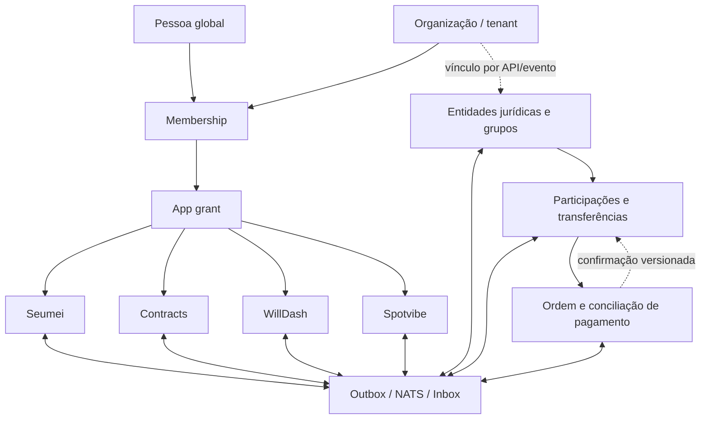
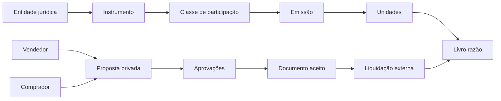

# Cockpit da Plataforma de Dados Matriz

**Status:** desenho V1 aprovado em princípio; implementação ainda não autorizada por este documento  
**Data de referência:** 2026-09-01  
**Autoridade:** leis arquiteturais do monorepo, matriz de ownership e este desenho  
**Mapa para agentes:** [`matriz-data-platform-map.json`](./matriz-data-platform-map.json)  
**Visão interativa:** [`visuals/matriz-data-platform-cockpit.html`](./visuals/matriz-data-platform-cockpit.html)

## 1. Resultado pretendido

A Matriz deve sustentar uma identidade global usando vários produtos e várias
organizações, sem transformar todos os domínios em um banco compartilhado sem
dono. A Seumei será o primeiro produto com clientes reais e, por isso, precisa
provar isolamento multitenant no PostgreSQL antes da expansão funcional.

A decisão V1 é um **monólito modular de dados extraível**:

- um cluster PostgreSQL por ambiente;
- um database `matriz` nesta fase;
- um schema, migration authority e runtime role por domínio;
- `core` como autoridade exclusiva de identidade e autorização;
- RLS forçada em toda tabela tenant-owned;
- APIs e eventos versionados entre domínios;
- nenhum app lê ou referencia tabelas internas de outro app;
- separação física futura por troca de endpoint e credencial, não por reescrita
  do domínio.

Não são objetivos da V1:

- microservices independentes para todos os apps;
- custódia de dinheiro ou saldo Pix pela Matriz;
- bolsa, token, NFT ou oferta pública de investimentos;
- GraphRAG, vetores ou analytics warehouse como fonte transacional;
- mover domínio de produto para packages compartilhados.

## 2. Vocabulário que não pode ser misturado

| Conceito          | Significado                                                    | Autoridade proposta        |
| ----------------- | -------------------------------------------------------------- | -------------------------- |
| Pessoa            | Identidade humana global, autenticação e preferências pessoais | `core` / Matriz Identity   |
| Organização       | Workspace colaborativo e fronteira de isolamento (`tenant`)    | `core` / Matriz Identity   |
| Membership        | Vínculo de uma pessoa com uma organização                      | `core` / Matriz Identity   |
| App grant         | Direito de usar um app, com roles e capabilities               | `core` / Matriz Identity   |
| Entidade jurídica | Empresa ou pessoa jurídica real, com jurisdição e documentos   | futuro domínio `corporate` |
| Grupo empresarial | Relações entre entidades jurídicas                             | futuro domínio `corporate` |
| Empresa Seumei    | Projeção operacional local usada pelo produto Seumei           | `seumei`                   |
| Participação      | Unidade econômica/societária e seu histórico de propriedade    | futuro domínio `equity`    |
| Pagamento         | Ordem, evidência e conciliação; não equivale à participação    | `pay`                      |

Uma organização pode representar uma equipe antes de existir CNPJ, operar mais
de uma entidade jurídica ou não possuir nenhuma. Uma entidade jurídica pode
participar de um grupo. Uma pessoa pode integrar várias organizações e ter
acessos diferentes em cada app.

Essa separação impede que `tenantId`, `companyId`, `cnpj` e `userId` virem o
mesmo identificador por conveniência.

## 3. Mapa humano



O diagrama mostra relacionamentos de autoridade. As setas não autorizam FKs ou
queries entre schemas.

## 4. Autoridades e schemas

### 4.1 Domínios atuais

| Schema      | Owner             | Tenancy                               | Responsabilidade                                                          |
| ----------- | ----------------- | ------------------------------------- | ------------------------------------------------------------------------- |
| `core`      | `matriz-identity` | mixed                                 | usuários, tenants, memberships, grants, sessões e auditoria de identidade |
| `hub`       | `matriz-hub`      | tenant + catálogos globais explícitos | documentos, conhecimento, capabilities e distribuição                     |
| `seumei`    | `seumei`          | tenant                                | empresa operacional, catálogo, pedidos, estoque e financeiro Seumei       |
| `contracts` | `contracts`       | tenant                                | contratos do produto                                                      |
| `willdash`  | `willdash`        | tenant                                | projeções e dashboards do produto                                         |
| `spot`      | `spot`            | tenant                                | domínio Spotvibe                                                          |
| `ops`       | `matriz-ops`      | operator-global                       | operação da plataforma                                                    |
| `pay`       | `matriz-pay`      | global-user na V1 atual               | ledger e integrações de pagamento                                         |

### 4.2 Domínios futuros reservados, não implementados agora

| Schema      | Owner futuro       | Motivo da fronteira                                                                |
| ----------- | ------------------ | ---------------------------------------------------------------------------------- |
| `corporate` | `matriz-corporate` | entidade jurídica e grupo empresarial são domínio forte, não identidade            |
| `equity`    | `matriz-equity`    | propriedade, negociação e trilha societária não pertencem a `core`, `hub` ou `pay` |

Reservar uma fronteira significa definir linguagem e contratos. Não significa
criar app, schema ou package antes de existir um caso de uso executável.

## 5. Invariantes multitenant

Toda request autenticada constrói no servidor um `AuthorizationContext`:

```text
sessionId
userId
tenantId
membershipId
appId
tenantRoles[]
appRoles[]
capabilities[]
locale
timezone
```

`tenantId`, roles e capabilities vêm exclusivamente de sessão/token validado.
Body, query string, headers livres e slugs nunca concedem autoridade.

Para toda operação tenant-owned:

1. o servidor valida sessão e app grant;
2. abre transação;
3. executa `SET LOCAL matriz.tenant_id = <tenantId>` por parâmetro;
4. usa apenas o client transacional;
5. PostgreSQL aplica RLS forçada;
6. commit ou rollback elimina o contexto local.

Regras de schema:

- `tenantId` obrigatório em toda tabela tenant-owned;
- unicidade inclui `tenantId` quando o valor é local ao tenant;
- relações tenant-owned usam chaves compostas que incluem `tenantId`;
- runtime roles são `NOINHERIT`, `NOBYPASSRLS` e não executam migrations;
- policies falham fechadas quando o contexto está ausente ou inválido;
- acesso público nunca reutiliza uma runtime role privilegiada.

### 5.1 Loja pública Seumei

Resolver `storeSlug` antes de conhecer o tenant conflita com RLS forçada. A V1
deve usar uma **projeção pública mínima**, atualizada por publicação de loja:

```text
publicStoreSlug -> tenantId + publicationId + status + canonicalHost
```

Ela não contém cliente, pedido, estoque privado ou dados financeiros. Depois da
resolução, a leitura da publicação acontece em transação com o tenant correto.
Não será usado `BYPASSRLS` no servidor público.

## 6. Estado atual honesto da Seumei

### Já existe

- `tenantId` nos principais modelos;
- constraints e relações compostas em parte relevante do schema;
- migrations com RLS forçada;
- helper transacional `withTenantContext`;
- Identity V2 com `TenantMembership` e `AppGrant`;
- contratos, testes unitários, lint, typecheck e build saudáveis após geração do
  Prisma Client.

### Ainda impede a afirmação “multitenant de verdade”

- somente o repositório de seleção de empresa usa `withTenantContext`;
- os demais repositórios filtram `tenantId`, mas não estabelecem o contexto RLS;
- páginas server-side ainda consultam a sessão mock do Hub enquanto as rotas de
  login usam OIDC;
- o storefront resolve slug sem contexto tenant;
- os testes de repositório usam mocks e não provam a runtime role real;
- não existe suíte PostgreSQL Tenant A × Tenant B cobrindo leitura, escrita,
  update, delete, agregações e transações concorrentes.

Conclusão: o modelo está preparado, mas a execução ainda não foi comprovada.

## 7. Banco e infraestrutura local

Topologia aprovada:

```text
Matriz Control Desktop
├── MatrizPostgres17  127.0.0.1:55432 / database matriz
│   └── core, hub, spot, seumei, contracts, willdash, ops, pay
├── MatrizGarnet      127.0.0.1:46379
└── MatrizNats        127.0.0.1:54222
    └── monitoring    127.0.0.1:58222
```

Estado verificado em 2026-09-01:

- PostgreSQL 17.4 instalado;
- PostgreSQL externo em `5432` ativo e fora do ownership Matriz;
- .NET Runtime 8 e Node 22 disponíveis;
- stack gerenciada Matriz ainda não instalada;
- portas `55432`, `46379`, `54222` e `58222` fechadas;
- código de instalação, migrations, seed, vault e recovery presente no Control,
  mas sem aceite operacional nesta máquina.

### Gate de banco local pronto

- [ ] serviços `MatrizPostgres17`, `MatrizGarnet` e `MatrizNats` healthy;
- [ ] listener externo `5432` idêntico antes e depois;
- [ ] oito schemas com migrations `clean`, checksums íntegros e sem drift;
- [ ] runtime/migration/worker roles conferidas;
- [ ] seed local e Identity funcionais;
- [ ] ambientes injetados pelo Control sem secrets em `.env` versionado;
- [ ] backup e restore temporário validados;
- [ ] replay Outbox/Inbox idempotente validado;
- [ ] suíte multitenant real aprovada.

## 8. Multiidioma, multimoeda e tempo

Idioma e moeda são dimensões diferentes de tenancy.

- `User.locale`: preferência individual, por exemplo `pt-BR`.
- `Tenant.defaultLocale`: padrão organizacional.
- `Document.locale`: idioma jurídico/fiscal congelado no documento.
- `Tenant.defaultCurrency`: preferência de exibição, não conversão automática.
- valores monetários usam inteiro em minor units ou decimal de precisão definida,
  nunca `float`;
- todo dinheiro carrega código ISO 4217;
- conversões guardam moeda de origem, destino, taxa, fonte e instante da cotação;
- documentos e lançamentos preservam o valor original;
- instantes são UTC; timezone serve para apresentação e regras locais explícitas.

Conteúdo traduzível de produto deve usar uma tabela/projeção de traduções com
fallback, e não dezenas de colunas `namePt`, `nameEn`, `nameEs`.

## 9. Domínio de participações privadas

A UX pode ser simples e colecionável, mas o modelo não é NFT. O ativo é uma
unidade registrada em um instrumento privado e sua validade depende de acordos
e documentos externos.

### 9.1 Blocos lógicos



### 9.2 Agregados futuros

- `Instrument`: o que está sendo representado e sob qual jurisdição;
- `ParticipationClass`: direitos, restrições e unidade de medida;
- `Issuance`: quantidade autorizada e emitida;
- `HolderAccount`: titular econômico/jurídico;
- `OwnershipLedgerTransaction`: operação imutável;
- `OwnershipPosting`: débito/crédito de unidades, com soma zero por operação;
- `PrivateOffer`: proposta entre partes conhecidas;
- `TransferApproval`: consentimentos e quórum;
- `AgreementArtifact`: hash, versão, assinaturas e retenção;
- `SettlementIntent`: valor, moeda, prazo e provedor esperado;
- `SettlementEvidence`: comprovante e conciliação sem armazenar segredo bancário;
- `ValuationSnapshot`: avaliação declarada com método, autor e data;
- `CapTableSnapshot`: projeção reconstruível do ledger, nunca fonte primária.

### 9.3 Máquina de estados

```text
DRAFT
  -> OFFERED
  -> ACCEPTED
  -> APPROVAL_PENDING
  -> DOCUMENT_PENDING
  -> SETTLEMENT_PENDING
  -> SETTLED
  -> RECORDED
```

Estados terminais alternativos: `REJECTED`, `EXPIRED`, `CANCELLED`, `DISPUTED`.
Uma operação `RECORDED` não é apagada. Correção acontece por lançamento
compensatório com referência causal.

### 9.4 Guardrails desde o protótipo

- rede privada e participantes convidados;
- nenhuma linguagem de “investimento garantido” ou rentabilidade automática;
- ausência de order book público na V1;
- limites configuráveis e feature flag para negociação;
- dupla aprovação para transferências;
- idempotency key em toda mutação financeira/societária;
- documentos e auditoria append-only;
- separação entre aceite comercial, liquidação e registro de propriedade;
- bloqueio técnico para custódia ou iniciação de pagamento sem integração e
  revisão apropriadas.

Uma oferta pública eletrônica pode entrar em regime específico da CVM. A
iniciação de transação de pagamento também possui requisitos próprios do Banco
Central, independentemente de o valor parecer pequeno. Este documento define
fronteiras técnicas, não substitui análise jurídica antes da ativação pública.

Referências oficiais mínimas:

- [Resolução CVM 88, com alterações](https://conteudo.cvm.gov.br/legislacao/resolucoes/resol088.html)
- [FAQ do Banco Central sobre autorização de instituições de pagamento](https://www.bcb.gov.br/meubc/faqs/p/quais-instituicoes-de-pagamento-devem-ser-autorizadas-a-funcionar-pelo-banco-central)
- [Guia de segurança da ANPD para agentes de pequeno porte](https://www.gov.br/anpd/pt-br/assuntos/noticias/anpd-publica-guia-de-seguranca-para-agentes-de-tratamento-de-pequeno-porte)

## 10. Comunicação e consistência

Transação local é forte; comunicação entre domínios é eventual.

```text
mutação de domínio + outbox (mesma transação)
  -> publisher
  -> NATS JetStream
  -> inbox + efeito do consumidor (mesma transação)
  -> ACK
```

Todo evento possui:

- `eventId`, `eventType` e `eventVersion`;
- `occurredAt` e `correlationId`;
- owner/app emissor;
- `tenantId` quando aplicável;
- referência de entidade, nunca entidade crua completa;
- payload mínimo e compatível com classificação de dados.

Consumidores são idempotentes. Falha externa não desfaz commit local; ela gera
retry observável e, quando esgotada, dead letter. Eventos não concedem
autoridade: o consumidor valida o tenant e suas próprias regras.

## 11. Erros, recuperação e observabilidade

- ausência de contexto tenant: negar e emitir evento de segurança sem payload;
- tenant divergente: negar, rollback e correlação auditável;
- conflito otimista: retornar conflito de versão, nunca last-write-wins oculto;
- provider de pagamento indisponível: manter intent pendente e retentável;
- NATS indisponível: outbox acumula sem perder a operação local;
- migration com drift: bloquear deploy e exigir reconciliação explícita;
- restore: restaurar primeiro em database temporário, validar e somente então
  promover;
- logs nunca exibem URLs com credenciais, tokens, documentos ou dados bancários.

Métricas mínimas: latência e erro por app, conexões PostgreSQL, locks, queries
lentas, violações RLS, idade da outbox, retries, dead letters, migrations e
idade do último backup válido.

## 12. Estratégia de prova

### 12.1 Testes obrigatórios da Seumei

1. Tenant A cria e lê seus dados.
2. Tenant B não lê, altera ou remove dados do A, mesmo conhecendo IDs.
3. Sem `matriz.tenant_id`, a runtime role não acessa dados tenant-owned.
4. `tenantId` forjado na request não troca autoridade.
5. Transações concorrentes no pool não vazam contexto.
6. Relação composta rejeita vínculo entre tenants.
7. Storefront público enxerga somente a projeção publicada.
8. Usuário sem `AppGrant(seumei)` recebe negação antes do repositório.
9. Revogação de membership invalida novas operações.
10. Backup/restore preserva policies, roles, migrations e dados.

Os testes de isolamento devem usar PostgreSQL real e a role
`matriz_seumei_runtime`; mocks continuam úteis apenas para regras unitárias.

### 12.2 Critério para declarar “multitenant de verdade”

- todos os repositórios tenant-owned passam pelo executor transacional único;
- sessão OIDC é a autoridade server-side única;
- nenhuma rota confia em tenant fornecido pelo cliente;
- testes A/B passam com a runtime role restrita;
- RLS é verificada por inspeção SQL e testes negativos;
- storefront público não exige bypass;
- evidências ficam registradas no cockpit.

## 13. Sequência de migração

### Fundação 0 — infraestrutura local

Instalar stack gerenciada, aplicar migrations explicitamente, executar seed,
injetar env via Control e validar backup/restore.

### Fundação 1 — autoridade única

Unificar OIDC e `AuthorizationContext`; retirar dependência runtime da sessão
mock do Hub.

### Fundação 2 — executor tenant

Aplicar `withTenantContext` em todos os repositórios Seumei e impedir o uso do
client Prisma bruto em operações tenant-owned.

### Fundação 3 — acesso público seguro

Criar projeção pública mínima do storefront e fluxo de publicação idempotente.

### Fundação 4 — prova real

Executar suíte Tenant A × Tenant B, pooling, falhas, backup/restore e Outbox.

### Fundação 5 — primeiro cliente real

Observabilidade, runbook, importação inicial, suporte operacional e rollback.

Somente depois da Fundação 4 a equipe começa o cockpit de features abaixo.

## 14. Cockpit das próximas dez features

| Ordem | Feature                     | Depende de                            | Owner provável      | Estado      |
| ----: | --------------------------- | ------------------------------------- | ------------------- | ----------- |
|     1 | Integração NFS-e nacional   | fundações 1–4, empresa e financeiro   | Seumei              | estacionada |
|     2 | Cockpit fiscal MEI          | NFS-e, calendário fiscal e documentos | Seumei              | estacionada |
|     3 | Pix Cobrança por provedor   | Pay, intents e conciliação            | Pay + Seumei        | estacionada |
|     4 | E-mail transacional         | eventos, templates e consentimento    | plataforma + Seumei | estacionada |
|     5 | Fornecedores e compras      | catálogo/estoque estabilizados        | Seumei              | estacionada |
|     6 | CMV e custo de receitas     | compras, estoque e receitas           | Seumei              | estacionada |
|     7 | Entrega e retirada          | pedidos, endereços e status           | Seumei              | estacionada |
|     8 | Cliente 360 e fidelidade    | consentimento e eventos comerciais    | Seumei              | estacionada |
|     9 | Privacidade e consentimento | identidade, auditoria e retenção      | Identity + apps     | estacionada |
|    10 | Dashboard operacional       | métricas e projeções confiáveis       | WillDash + apps     | estacionada |

“Estacionada” significa desenhada para não bloquear a base, não descartada.

## 15. Como o coworking ajuda

O usuário continua sendo autoridade de produto e decisões empresariais. O
workflow recomendado usa tarefas especializadas, sempre com escopo explícito:

1. **Arquiteto:** mantém vocabulário, invariantes e ADRs.
2. **DBA:** revisa migrations, índices, RLS, roles, pooling e recovery.
3. **Implementador por app:** altera somente o bounded context autorizado.
4. **Revisor adversarial:** tenta quebrar tenant isolation e idempotência.
5. **Verificador UX:** percorre onboarding e fluxos reais no navegador.
6. **Release steward:** reúne evidências e decide promoção/rollback.

Trabalhos independentes podem ocorrer em paralelo; mudanças no mesmo schema,
contrato ou migration devem permanecer sequenciais. Agentes não recebem acesso
direto a secrets e não tornam decisões jurídicas implícitas.

## 16. Decisões registradas por este cockpit

1. A V1 usa monólito modular de dados extraível.
2. Pessoa, tenant, entidade jurídica e empresa de produto são conceitos
   diferentes.
3. Core possui identidade e grants, não domínio empresarial.
4. Seumei possui suas regras e projeções operacionais.
5. `corporate` e `equity` são fronteiras futuras, não packages compartilhados.
6. Participações usam ledger imutável; UX não define a natureza do ativo.
7. Pix é liquidação externa na V1; Matriz não mantém custódia.
8. Microservices surgem por pressão observada, não por antecipação.
9. PostgreSQL real com runtime role é requisito de aceite multitenant.
10. As dez features ficam posteriores às fundações essenciais.

## 17. Riscos e revisões futuras

Revisar este desenho quando ocorrer qualquer um:

- primeiro cliente externo em produção;
- mais de uma equipe alterando o mesmo domínio;
- necessidade de residência geográfica de dados;
- carga ou disponibilidade exigir separação física;
- ativação de negociação para público não convidado;
- custódia, iniciação de Pix ou saldo movimentável;
- recomendação jurídica exigir mudança do instrumento;
- dois apps comprovarem necessidade de uma abstração compartilhada estável.

Até esses sinais, otimização significa bons índices, queries medidas, isolamento
provado, migrations seguras e operação recuperável — não multiplicar serviços.
