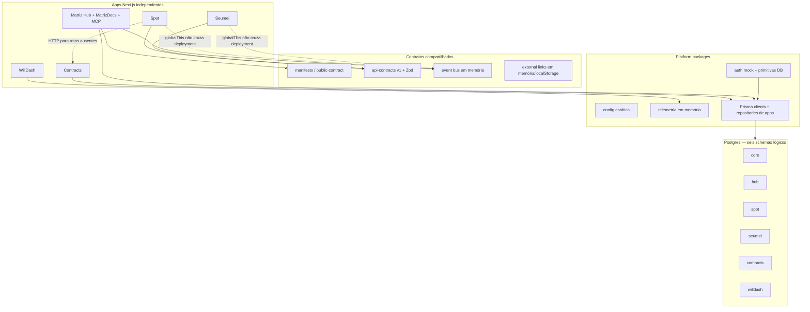
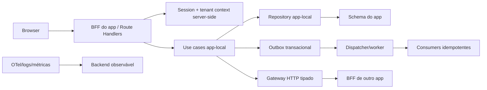
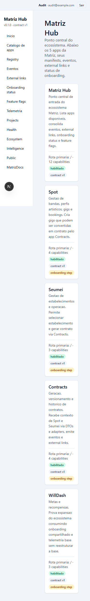
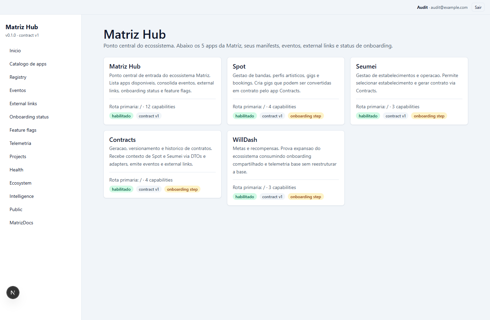

# Auditoria técnica completa — Matriz Infra Hub

**Data:** 27 de julho de 2026  
**Papel assumido:** Principal Software Architect / Staff Engineer / Security, Performance, Product e UX Engineering  
**Escopo auditado:** estado completo do working tree, incluindo alterações ainda não commitadas de MatrizDocs  
**Natureza do trabalho:** auditoria somente; nenhuma correção funcional foi aplicada

---

## 1. Resumo executivo

### Veredito

O `matriz-infra-hub` é uma **boa prova arquitetural e uma base promissora de experimentação**, mas **ainda não deve ser tratado como fundação pronta para SaaS, multi-tenancy ou ecossistema distribuído em produção**.

A principal qualidade do projeto é a intenção arquitetural explícita: existem leis, manifests por app, contratos versionados, DTOs validados por Zod, boundaries automatizados, presenters e uma preferência correta por implementação app-local. Isso é mais disciplina do que se encontra em muitos monorepos jovens.

O principal problema é que a arquitetura executável ainda não cumpre a arquitetura declarada:

- autenticação efetiva é mock, client-side e persistida em `localStorage`;
- APIs mutantes, MatrizDocs e MCP não validam sessão;
- identidade e tenant são aceitos de headers controláveis pelo cliente;
- comunicação entre apps usa memória de processo ou chamadas para rotas inexistentes;
- telemetria, eventos, external links e registry “globais” não atravessam processos, regiões, browsers ou deployments;
- não há migrations versionadas nem bootstrap reproduzível do Postgres;
- relações multi-tenant não são protegidas por constraints compostas;
- a suíte “cross-app” instancia todos os lados dentro do mesmo processo e, portanto, não prova integração entre apps reais;
- a versão atual de Next.js possui vulnerabilidades conhecidas e corrigidas em patches posteriores.

Em termos práticos: o repositório prova bem **formas, contratos e intenção**, mas ainda não prova **consistência, segurança e operação distribuída**.

### Decisão recomendada

**Continuar investindo no monorepo, sem recomeçar do zero**, mas executar uma etapa de estabilização antes de adicionar novos módulos ou extrair packages. A arquitetura conceitual é aproveitável. O runtime precisa ser realinhado às leis.

Não recomendo, neste momento:

- quebrar o sistema em microserviços;
- adicionar Kafka, Kubernetes ou service mesh;
- criar novos packages compartilhados;
- adotar uma plataforma genérica de plugins;
- migrar todos os apps para repositórios separados;
- iniciar RAG/embeddings antes de fechar autorização, tenant isolation e migrations.

Recomendo primeiro um desenho simples:

1. sessão server-side única e verificável;
2. tenant derivado exclusivamente da sessão/authorization context;
3. BFF/route handlers reais nos apps;
4. Postgres com migrations, constraints e testes de isolamento;
5. integração síncrona por HTTP tipado quando resposta imediata for necessária;
6. outbox persistente para eventos assíncronos;
7. observabilidade externa, não memória de processo.

### Cinco riscos que bloqueiam adoção como base de longo prazo

1. **Bypass total de autenticação/autorização no Hub, MatrizDocs e MCP.** Evidências: `apps/matriz-hub/src/domains/docs/application/access.ts:26-58`, `apps/matriz-hub/app/api/docs/documents/route.ts:9-41`, `apps/matriz-hub/app/api/mcp/route.ts:14-55`.
2. **Isolamento multi-tenant vulnerável no código e não garantido no banco.** A revisão de sugestão altera o registro antes de validar o tenant (`docs-repository.ts:431-442`), e relações usam apenas `id` em vez de `[tenantId, id]` (`prisma/schemas/hub.prisma:229-232`, `352-353`; padrões equivalentes nos demais schemas).
3. **Integração cross-app não existe no runtime implantado.** Os gateways chamam rotas ausentes (`apps/spot/src/integration/gateways/contracts.gateway.ts:25-37`; `apps/seumei/src/integration/gateways/contracts.gateway.ts:18-30`), enquanto o fallback fabrica um DTO sem criar contrato (`spot/.../contracts.gateway.ts:40-70`).
4. **Ausência completa de histórico de migrations.** Existem seis schemas válidos, mas nenhum `migration.sql`; logo não há processo auditável e repetível de evolução do banco.
5. **Dependência de Next.js vulnerável.** `next@16.2.4` aparece em todos os apps (`apps/matriz-hub/package.json:32-34` e equivalentes). `pnpm audit --prod`, em 27/07/2026, reportou 26 vulnerabilidades: 14 high, 10 moderate e 2 low; patches estão disponíveis.

### Nota geral

**4,2 / 10**

Essa nota não mede potencial nem qualidade das ideias; mede prontidão do estado atual para sustentar cinco anos de produtos SaaS. A diferença entre documentação e runtime, somada aos riscos de segurança/tenant, reduz fortemente a avaliação.

---

## 2. Metodologia, abrangência e limitações

### O que foi inspecionado

- cinco apps Next.js: Hub, Spot, Seumei, Contracts e WillDash;
- packages de foundation, design, access, platform, integration e flows;
- seis schemas Prisma;
- manifests, bootstraps e public contracts;
- rotas App Router e APIs;
- autenticação mock e primitivas server-side;
- MatrizDocs, MCP, ingestion e persistência;
- testes, scripts, lint, TypeScript, Turbo e GitHub Actions;
- design system, shells, login e estados;
- documentação arquitetural e relatórios anteriores;
- dependências instaladas e advisories atuais.

O inventário encontrou aproximadamente:

| Área | Arquivos | Linhas aproximadas |
|---|---:|---:|
| `apps/` | 268 | 13,3 mil |
| `packages/` | 167 | 7,5 mil |
| `prisma/` | 6 | 1,3 mil |
| `tests/` | 17 | 1,9 mil |
| `docs/` | 38 | 4,9 mil |

### Checks executados

| Check | Resultado | Interpretação |
|---|---|---|
| `pnpm install --frozen-lockfile` | passou | lockfile reproduzível, mas Prisma não gerou clients por não haver schema default |
| primeiro `pnpm test:smoke` | **107/118** | 11 falhas por Prisma Clients ausentes |
| primeiro `pnpm typecheck` | **falhou** | imports de `.prisma/core` inexistentes |
| `pnpm prisma:generate` | passou | gera somente core, hub, seumei e contracts; omite spot e willdash |
| segundo `pnpm test:smoke` | **118/118** | verde após geração manual |
| segundo `pnpm typecheck` | passou, 28 tasks | cinco packages do escopo não possuem task correspondente |
| `pnpm lint` | passou, 28 tasks | boundaries sintáticos cobertos |
| `pnpm prisma:validate` | 6/6 schemas | sintaxe Prisma válida |
| `pnpm build` | 5/5 apps | todos compilam e geram rotas |
| `pnpm audit --prod` | **falhou** | 26 vulnerabilidades, 14 high |
| Playwright desktop/mobile | executado | login mock, home do Hub, rota MatrizDocs degradada e responsividade |

### Limitações

- O Postgres local não estava disponível. Não foram executadas mutations ou testes destrutivos contra banco.
- O estado auditado inclui código não commitado de MatrizDocs. O relatório descreve o produto como encontrado, não apenas `HEAD`.
- O arquivo `.env` existe e está ignorado; não foi lido, copiado ou exposto.
- Não havia ambiente de staging, telemetria real ou dados de produção para medir Web Vitals, carga ou consultas.
- Acessibilidade foi analisada por semântica, DOM renderizado e layout; não há suíte axe/Lighthouse no projeto.

---

## 3. Visão geral da arquitetura atual

### O que está correto no desenho

- Apps são unidades explícitas e possuem `manifest.ts`, `bootstrap/index.ts` e `public-contract.ts`.
- O Hub importa outros apps somente pelo public contract (`apps/matriz-hub/src/bootstrap/index.ts:12-16`).
- DTOs cross-app são versionados e possuem schemas Zod.
- A matriz de imports é automatizada por ESLint (`eslint.config.mjs:48-94`) e smoke tests.
- As camadas locais de Spot, Seumei e Contracts mostram domínio, repository, use case e presenter.
- O uso de cinco projetos Next.js separados mantém possibilidade de deploy independente.

### Onde o desenho quebra

- “Global” significa apenas o `globalThis` de um processo (`packages/integration/events/src/index.ts:321-332`; `registry-core/src/index.ts:105`; `external-links/src/index.ts:104`).
- Cada app roda em processo/origem próprios; portanto, esses singletons não são um barramento nem agregador de ecossistema.
- O browser de Spot e o browser de Contracts também não compartilham `globalThis`, especialmente em origens/abas diferentes.
- `platform-db` carrega repositories específicos de Contracts, Seumei e Hub, violando o princípio de domínio local (`packages/platform/db/package.json:6-14`).
- “Schema por app” está conceitualmente correto, mas a lei L1 lista cinco schemas e omite o Hub (`docs/architectural-laws.md:13-21`), enquanto o runtime usa seis.

### Arquitetura-alvo recomendada

Manter o monorepo e os apps separados, mas substituir simulações por portas reais:

Isso preserva modularidade sem introduzir infraestrutura prematura:

- HTTP para comando que precisa de resposta;
- outbox + worker para evento assíncrono;
- Postgres como primeira infraestrutura durável;
- broker dedicado somente quando volume/latência justificarem.

---

## 4. Pontos fortes

### 4.1 Leis arquiteturais explícitas

`docs/architectural-laws.md` é o ativo mais valioso do projeto. As leis sobre ownership, contracts, presenter, feature flags e app-local-first estão na direção correta. A regra “extrair somente após uso real por dois apps” reduz package pollution.

### 4.2 Boundaries automatizados

O ESLint proíbe imports entre internals de apps e packages → apps (`eslint.config.mjs:51-94`). O script adicional faz varredura (`tooling/scripts/verify-app-boundaries.ts:43-79`). Os imports cross-app encontrados no Hub usam `public-contract`.

Limitação: o boundary checker usa testes por string/regex e não constrói um grafo TypeScript completo. Em Windows, algumas verificações usam `/src/auth/` contra paths com `\`, o que pode reduzir cobertura (`verify-app-boundaries.ts:65-74`). ESLint compensa parte disso.

### 4.3 Contratos versionados e validação

`integration-api-contracts` e os manifests possuem superfície explícita, DTOs e Zod. O contrato MatrizDocs é abrangente e versionado. É uma base adequada para OpenAPI, SDKs e contract testing.

### 4.4 Baixo excesso de Client Components

Foram encontrados apenas 18 arquivos TSX com `"use client"` entre 101 TSX nos cinco apps. Leituras importantes permanecem em Server Components. Isso é uma boa base para bundle pequeno e segurança de secrets.

### 4.5 Camadas locais compreensíveis

Spot e Seumei apresentam repositories, use cases e presenters app-locais. A direção é melhor do que centralizar domínio em `packages/*`.

### 4.6 Design tokens iniciais

Há escalas de spacing, radius, tipografia e temas por app em `packages/design/system/src/index.ts:19-58` e `81-137`. `themeToCssVars` dá uma superfície simples para branding (`147-165`).

### 4.7 Degradação graciosa parcial

Sem Postgres, `/docs` não derruba toda a aplicação. A UI mostra um estado explicativo. Isso é melhor do que erro branco, embora a mensagem exponha detalhes internos do Prisma e host do banco.

### 4.8 Ausência de sinks óbvios de XSS

Não foram encontrados `dangerouslySetInnerHTML`, `eval`, `innerHTML`, `document.write` ou uso de `NEXT_PUBLIC_*` com secrets no código auditado.

### 4.9 Builds reais passam

Depois de gerar os Prisma Clients, todos os cinco apps compilam com Next.js 16.2.4. Isso prova coerência de tipos e bundling no snapshot atual.

---

## 5. Pontos fracos e problemas críticos

## 5.1 Segurança e autorização — crítica

### SEC-01 — Identidade e tenant fornecidos pelo atacante

`getDocsActorContextFromHeaders` aceita `x-tenant-id`, `x-actor-id`, `x-actor-type` e nome diretamente do request, com fallback para um usuário humano (`apps/matriz-hub/src/domains/docs/application/access.ts:26-45`). Depois, `canReadDocsTarget` autoriza qualquer `human_user` a ler qualquer visibilidade/sensibilidade (`48-58`).

**Impacto:** um cliente pode se declarar humano, escolher um tenant e ler/escrever dados daquele tenant.

**Correção:** remover completamente identidade derivada de headers públicos. Resolver sessão em cookie `HttpOnly`, carregar membership no servidor e construir um `AuthorizationContext` imutável. Headers internos só podem ser aceitos atrás de um gateway autenticado e assinados/mTLS.

### SEC-02 — APIs mutantes sem autenticação

As rotas MatrizDocs constroem actor diretamente do request e executam writes (`apps/matriz-hub/app/api/docs/documents/route.ts:25-41`). O refresh institucional também não possui guard (`app/api/institutional/refresh/route.ts:21-50`). Não há `proxy.ts`, middleware ou guard server-side em nenhum app.

**Impacto:** criação, edição, publicação, review, export e ingestion podem ser acionados sem sessão verificável.

### SEC-03 — MCP público com ferramentas mutantes

`POST /api/mcp` aceita JSON-RPC sem autenticação, limite de batch ou limite de body (`apps/matriz-hub/app/api/mcp/route.ts:32-55`). `tools/call` chama ferramentas diretamente (`src/mcp/handler.ts:98-113`). A lista inclui `refresh_project_ingestion` e ferramentas MatrizDocs mutantes.

Erros internos são devolvidos em `error.data` (`handler.ts:125-135`).

**Impacto:** exfiltração de resources, alteração de estado, DoS por batch e vazamento de detalhes internos.

### SEC-04 — Mutação cross-tenant antes da validação

`reviewSuggestion` executa `update({ where: { id } })` e só depois chama `assertTenantScoped` (`docs-repository.ts:431-442`).

**Impacto:** um atacante que conheça um ID de outro tenant altera a sugestão; recebe erro depois que a corrupção já ocorreu.

**Correção imediata:** update por chave composta/`updateMany({ where: { id, tenantId } })`, verificar `count === 1` e criar teste de regressão com dois tenants.

### SEC-05 — Relações não garantem tenant consistente

Os filhos repetem `tenantId`, mas FKs apontam apenas para `id`. Exemplos:

- `DocBlock → DocDocument/Version`: `prisma/schemas/hub.prisma:229-232`;
- `KnowledgeEdge → KnowledgeNode`: `hub.prisma:352-353`;
- `ContractParty → Contract`: `contracts.prisma:79`;
- `ArtistProfile → Band`: `spot.prisma:61`;
- `EstablishmentProfile → Establishment`: `seumei.prisma:76`;
- `Reward → Goal`: `willdash.prisma:74`.

**Impacto:** o banco permite que uma row do tenant A referencie uma entidade do tenant B. Filtros de aplicação não são defesa suficiente.

### SEC-06 — Auth real existe como biblioteca, mas não é adotada

Todos os apps configuram `createOtpStrategy()` ou `createMagicLinkStrategy()` mock. OTP aceita código fixo (`packages/platform/auth/src/v1/strategies/otp.strategy.ts:21-61`), magic link gera e devolve token ao próprio cliente, e sessão é persistida por `localStorage` (`AuthProvider.tsx:48-74`, `133-140`).

Há primitivas melhores em `src/v1/server`, mas nenhuma rota de login/callback/cookie as usa.

O `AuthGate` é somente visual/client-side (`packages/platform/auth/src/v1/guards/AuthGate.tsx:21-31`). Isso não protege RSC, APIs ou dados.

### SEC-07 — Challenge verification não é atômica

`verifyChallenge` busca, compara e depois consome em chamadas separadas (`packages/platform/auth/src/v1/server/challenges.ts:129-157`). Requisições concorrentes podem validar o mesmo challenge antes do consume.

### SEC-08 — Ausência de controles HTTP

Não há evidência de:

- rate limiting;
- limite de body/upload/batch;
- CSP, HSTS e política de framing customizada;
- CSRF para o futuro modelo cookie-based;
- CORS explícito para MCP/APIs;
- redaction estruturada de logs;
- auditoria de comandos privilegiados.

`docsErrorResponse` devolve `Error.message` bruto (`app/api/docs/_helpers.ts:31-33`).

### SEC-09 — Next.js desatualizado em patch de segurança

Todos os apps usam `16.2.4`. O audit atual reportou 14 advisories high. Exemplos oficiais:

- [DoS em React Server Components, corrigido em 16.2.5](https://github.com/advisories/GHSA-8h8q-6873-q5fj);
- [bypass de Proxy/Middleware no App Router, corrigido em 16.2.6](https://github.com/advisories/GHSA-26hh-7cqf-hhc6);
- [cache confusion, corrigido em 16.2.11](https://github.com/advisories/GHSA-68g3-v927-f742).

Existe release [Next.js 16.2.12](https://github.com/vercel/next.js/releases/tag/v16.2.12). O patch deve ser aplicado e validado imediatamente.

---

## 5.2 Integração e backend — crítica/alta

### INT-01 — Gateways chamam endpoints que não existem

Spot chama `/api/contracts/from-gig` (`apps/spot/src/integration/gateways/contracts.gateway.ts:25-35`). Seumei chama `/api/contracts/from-establishment` (`apps/seumei/src/integration/gateways/contracts.gateway.ts:18-28`). O app Contracts não possui nenhum `route.ts`.

No client, o resolver escolhe o bus em memória (`spot/.../contracts.gateway.ts:74-76`) e devolve um `ContractSummaryDTO` fabricado (`56-69`). Nenhum contrato, external link ou evento durável é persistido.

**Resultado:** a UI pode informar sucesso para uma operação que não aconteceu.

### INT-02 — Event bus não é cross-app

O bus mantém handlers e history em `Map`/array (`packages/integration/events/src/index.ts:263-318`) e o singleton em `globalThis` (`321-332`).

Vantagem: ótimo fake para testes unitários e desenvolvimento local.

Desvantagem: não cruza:

- processos Next.js;
- funções serverless;
- instâncias/regions;
- abas e origens do browser;
- restart/redeploy.

O mesmo problema afeta external links, registry e telemetry.

### INT-03 — Teste “end-to-end cross-app” não é end-to-end

`tests/smoke/application-flow.test.ts` importa diretamente internals de Contracts (`38-43`), cria EventBus, ExternalLinkStore e repositories em memória no mesmo processo (`56-65`) e chama o use case diretamente (`120-128`).

O teste é útil como teste de composição/contrato. O nome “end-to-end cross-app” e as conclusões associadas são excessivos.

### INT-04 — Configuração de URLs é localhost em qualquer ambiente

`monorepoConfig.environment` detecta produção, mas `baseUrls` continua fixo em `http://localhost:3000-3004` (`packages/platform/config/src/index.ts:29-43`).

**Impacto:** gateways server-side falham em preview/produção e o link “Voltar ao Hub” também aponta para localhost (`apps/spot/src/ui/components/AppShell.tsx:33-38`).

### INT-05 — Adapter real depende de mock

`input-to-contract.adapter.ts` importa `newContractId` de `../../mock/repositories` (`apps/contracts/src/integration/adapters/input-to-contract.adapter.ts:7,25,52`).

**Impacto:** a camada de integração não é substituível sem o mock. O gerador de ID deve ser uma dependency/port app-local.

### INT-06 — Referência nativa contradiz a lei de ExternalLink

O aggregate grava `externalReference` com ID de Gig/Establishment (`input-to-contract.adapter.ts:31,58`) e o schema real grava `originEntityId` (`prisma/schemas/contracts.prisma:27-33`).

Isso contradiz a regra documentada de que IDs externos devem viver em ExternalLink. A duplicação cria duas fontes de verdade e dificulta split do app.

---

## 5.3 Dados e multi-tenancy — crítica/alta

### DATA-01 — Sem migrations

Não há diretório `prisma/migrations` nem um único `migration.sql`. A própria UI orienta “aplique a migration”, mas não existe migration versionada.

O Prisma descreve o histórico de migrations como fonte de verdade para evolução do modelo e produção: [Prisma migration histories](https://www.prisma.io/docs/orm/prisma-migrate/understanding-prisma-migrate/migration-histories).

**Impacto:**

- ambientes não são reproduzíveis;
- drift não é detectável;
- rollback/data migration não são planejados;
- deploy de schema depende de ação manual não auditável.

### DATA-02 — Geração de clients incompleta

`prisma:validate` cobre os seis schemas (`package.json:13-19`), mas `prisma:generate` cobre somente quatro (`20-24`), omitindo Spot e WillDash.

Em clone limpo, typecheck e smoke falham antes da geração. A CI também não executa `prisma:generate` (`.github/workflows/ci.yml:22-31`).

### DATA-03 — Imports dependem de internals de `node_modules`

Os clients são importados por caminhos como `../../../../node_modules/.prisma/core/index.js` (`packages/platform/db/src/core.ts:13,38-39`).

**Impacto:** acoplamento ao layout físico do package manager; já falhou no primeiro smoke/typecheck. Prisma 7 exige output explícito e novo client, então a dívida crescerá. O [guia oficial do Prisma 7](https://www.prisma.io/docs/guides/upgrade-prisma-orm/v7) confirma mudanças importantes no client/output e recomenda migração planejada.

### DATA-04 — DB URL falha aberta

Se envs estiverem ausentes, o código tenta credencial placeholder local (`packages/platform/db/src/core.ts:21-33` e wrappers equivalentes).

Em produção, env ausente deveria abortar boot com mensagem controlada, usando `requireEnv`, e nunca tentar uma URL default.

### DATA-05 — MatrizDocs retorna blocos de todas as versões

`getDocument` inclui `blocks` apenas por documento (`docs-repository.ts:71-80`), sem filtrar `versionId: currentVersionId`, e os retorna integralmente (`107-114`).

Após atualizações, blocos antigos e atuais são misturados. Isso afeta render, export, contexto MCP, contagem e custo.

### DATA-06 — Agregados escritos sem transação

Criação/import/versionamento de documento executam múltiplas writes e side effects sem `$transaction`. Em falha intermediária, documento, versão, blocos, chunks, entidades, sugestões e timeline podem divergir.

### DATA-07 — N+1 de escrita

`createBlocks` faz uma `create` por bloco (`769-789`), `createChunks` outra por bloco (`792-806`) e `detectEntities` cria node, mention e timeline em loops aninhados (`809-834`).

**Impacto:** latência proporcional ao tamanho do documento, muitas conexões/round-trips e risco de timeout serverless.

### DATA-08 — Embeddings/RAG ainda são flags

`DocChunk.embedding` é `Json?` (`hub.prisma:247-252`), e o repository marca `semanticSearchPrepared: true` sem calcular embedding (`docs-repository.ts:792-804`). Não há vector index, retrieval, modelo de embedding ou avaliação.

Isso é preparação de shape, não RAG operacional.

### DATA-09 — JSON e strings em excesso

MatrizDocs usa bastante `Json` e enums representados como strings. Isso acelera POC, porém reduz constraints, queryabilidade, migrations seguras e análise SQL. JSON deve ficar para payloads realmente variáveis; estados, tipos, visibility, sensitivity e relações precisam de invariantes fortes.

---

## 5.4 Estrutura, domínio e packages — alta

### ARCH-01 — Domínio de app dentro de package compartilhado

`packages/platform/db` contém repositories de:

- Contracts: `src/repositories/contracts/*`;
- Seumei: `src/repositories/seumei/*`;
- Hub: `src/repositories/hub/*`.

Isso conflita diretamente com L12 e com a instrução “nunca mova domínio de app para package compartilhado”. Esses adapters pertencem a `apps/<app>/src/integration/persistence/prisma`.

O package pode manter somente:

- fábrica/infra neutra de conexão, se realmente compartilhada;
- tipos utilitários sem semântica de produto;
- client core quando seu ownership for formalmente de plataforma.

### ARCH-02 — Packages sem contrato de responsabilidade

Nenhum package possui `AGENTS.md`, apesar do modelo de governança exigir responsabilidade, imports permitidos/proibidos e exemplos. `platform-db` também não possui scripts de lint/typecheck e ficou fora das 28 tasks efetivas.

### ARCH-03 — Quatro de cinco AGENTS de app estão vazios

`apps/matriz-hub/AGENTS.md`, `apps/spot/AGENTS.md`, `apps/contracts/AGENTS.md` e `apps/willdash/AGENTS.md` têm zero bytes. Apenas Seumei oferece instruções táticas.

Isso prejudica onboarding humano e agentes.

### ARCH-04 — Documentos obrigatórios ausentes

`docs/DECISION-LOG.md` e `docs/CHANGE-SAFETY.md`, previstos pelas próprias instruções do repositório, não existem.

### ARCH-05 — MatrizDocs repository é um God object

`apps/matriz-hub/src/domains/docs/integration/prisma/docs-repository.ts` possui mais de 1.200 linhas e mistura:

- queries;
- autorização;
- transações implícitas;
- parsing;
- chunking;
- entity extraction;
- suggestions;
- timeline;
- export;
- MCP snapshot;
- mapeamento DTO;
- formatação Markdown.

Deve ser decomposto por capability app-local, sem criar package compartilhado:

- `documents.repository`;
- `context.repository`;
- `knowledge.repository`;
- `suggestions.repository`;
- `timeline.repository`;
- serviços de ingestão/conversão;
- transaction coordinator.

### ARCH-06 — Casts substituem invariantes

Foram encontrados 70 `as never` e 28 `as unknown as`. Não há `any`, o que é positivo, mas `as never` recorrente esconde incompatibilidades em enums, JSON e branded IDs.

Rotas recebem `String(body.type) as never` em vez de executar o schema Zod já existente (`app/api/docs/documents/route.ts:30-36`).

### ARCH-07 — IDs de POC infiltrados

`generateId` usa timestamp, contador e `Math.random` (`packages/foundation/utils/src/index.ts:149`). É aceitável para mocks, não para identificadores públicos, idempotency keys, tokens ou sistemas distribuídos.

---

## 5.5 Frontend, Next.js, UX e UI — média/alta

### FE-01 — Nenhum estado especial do App Router

Não existe `loading.tsx`, `error.tsx` ou `not-found.tsx` customizado em nenhum app. O `_not-found` exibido no build é o fallback do framework.

Consequências:

- rotas dinâmicas do Hub/MatrizDocs não fazem streaming/skeleton;
- erros sobem sem recovery segmentado;
- 404 não comunica produto/contexto;
- UX de banco lento tende a depender do TTFB.

### FE-02 — `force-dynamic` usado amplamente

MatrizDocs e várias páginas institucionais marcam `force-dynamic` indiscriminadamente. Parte é justificável por dados por request, mas sem sessão server-side e sem política de cache não há decisão explícita entre:

- data freshness;
- cache por tenant;
- revalidation;
- streaming;
- conteúdo público estático.

O resultado é perda de cache e maior custo de servidor sem benefício de segurança.

### FE-03 — Mobile do Hub está quebrado

`HubShell` fixa sidebar em 240 px e mantém layout horizontal (`apps/matriz-hub/src/ui/components/HubShell.tsx:10-23`), com main de 32 px de padding (`64-65`). Em viewport de 375 px, o conteúdo fica comprimido em uma coluna com aproximadamente metade da tela.

Evidência visual:

No desktop, a hierarquia é legível, mas há grande área vazia e o shell não destaca rota ativa:

### FE-04 — Navegação não é responsiva

Spot, Seumei, Contracts e WillDash mostram nav horizontal sem menu mobile ou wrap robusto. Spot também exibe descrição longa dentro do header (`apps/spot/src/ui/components/AppShell.tsx:14-39`).

### FE-05 — Tenant da UI não é tenant da sessão

Há `TenantProvider`, mas páginas server-side ignoram seu estado e hardcodam tenants:

- Spot/Seumei usam `mockTenants[0]` (`apps/spot/app/page.tsx:7-11`);
- Contracts/WillDash usam `"tenant-acme"`;
- auth mock resolve `"tenant_demo"`;
- seeds Spot usam `"tenant-matriz"` e `"tenant-acme"` (`apps/spot/src/mock/seeds.ts:11-12`);
- constants usam `"tenant_demo"` e `"tenant_acme"`.

Hífens e underscores também variam. Em Spot, o tenant default não corresponde aos seeds e a dashboard tende a ficar vazia.

### FE-06 — Páginas consomem mock diretamente

`apps/willdash/app/dashboards/page.tsx:3-12` importa `seedDashboards`, contrariando L5. `apps/contracts/app/templates/page.tsx:4` instancia repository mock diretamente.

### FE-07 — Design system não é realmente a fonte única

Há tokens, mas:

- `themeToCssVars` não emite `--radius-md`, embora o Hub use essa variável (`HubShell.tsx:53`);
- `radiusScale.md` é `0.5rem` (`design/system/src/index.ts:34-41`), mas `.rounded-md` no shim é `0.375rem` (`design/ui/src/utility-shim.css:118-121`);
- badges de estado usam cores hardcoded (`primitives.tsx:252-257`);
- login screens repetem grandes objetos de inline style e cores de erro;
- foram encontrados 62 usos de cores CSS hardcoded na camada visual analisada.

### FE-08 — “Tailwind preset” não é Tailwind operacional

Todos os apps importam `utility-shim.css`. Esse arquivo mantém manualmente um subconjunto de classes (`utility-shim.css:42-239`). O preset existe, mas Tailwind não está configurado como compilador do app.

Vantagem: CSS pequeno e previsível para POC.

Desvantagens:

- qualquer classe nova pode renderizar sem estilo silenciosamente;
- variantes/responsividade dependem de edição manual;
- tokens e utilities podem divergir;
- DX simula Tailwind sem ter garantias do Tailwind.

Escolha uma direção:

1. CSS Modules/vanilla CSS + primitives/tokens; ou
2. Tailwind real com preset e scanning.

Não manter um “mini Tailwind” manual por anos.

### FE-09 — Acessibilidade incompleta

Pontos positivos:

- `Button` usa elemento nativo e `focus-visible` (`primitives.tsx:203-231`);
- `Alert` usa `role="alert"` (`276-298`);
- logins oferecem `aria-label`.

Problemas:

- não há skip link;
- Hub `<nav>` não possui `aria-label`;
- links não usam `aria-current`;
- vários forms MatrizDocs usam apenas placeholder, sem label acessível, por exemplo `docs/exports/page.tsx:22-25` e `docs/context/page.tsx:21-26`;
- estados de sucesso/warning dependem de cor/badge;
- não há teste automatizado axe;
- responsividade ruim cria zoom/scroll e baixa legibilidade.

### FE-10 — Font, assets e metadata mínimos

Não há uso de `next/font`, ícones/manifest/OG consistentes ou favicon customizado; o browser registrou 404 para `/favicon.ico`. Metadata raiz existe, mas é genérica e não usa templates por rota.

Não há imagens relevantes hoje, então ausência de `next/image` não é um problema atual.

---

## 5.6 Performance — média

### Pontos positivos

- maioria das páginas é Server Component;
- Client Components são localizados;
- várias queries independentes usam `Promise.all`, inclusive MatrizDocs;
- builds usam Turbopack e cinco apps separam bundles;
- não há bibliotecas frontend pesadas evidentes.

### Gargalos reais

1. **N+1 de escrita MatrizDocs** — maior risco atual.
2. **Sem paginação consistente** — vários lists usam `take: 100`; outros não têm limite.
3. **`listTimeline` aceita limit sem clamp** (`docs-repository.ts:600-608`); query params podem gerar valor enorme/inválido.
4. **`getDocument` carrega versões, blocos, mentions e contexts de uma vez** (`71-80`), inadequado para documentos grandes.
5. **Blocos de todas as versões** aumentam payload e custo.
6. **`force-dynamic` generalizado** elimina oportunidades de cache/revalidation.
7. **Sem loading/Suspense de rota** reduz percepção de velocidade.
8. **Telemetria em memória** não mede Web Vitals, TTFB, query time ou falhas reais.
9. **Muitos clients Prisma separados em serverless** precisam de estratégia de pooling/adapter; não há evidência de pooler.
10. **MCP batch ilimitado e `Promise.all`** permite explosão de concorrência (`app/api/mcp/route.ts:47-51`).

### Memoização

Não há problema relevante de “falta de `React.memo`”. O projeto possui poucos Client Components e baixa complexidade de re-render. Adicionar memoização agora seria otimização prematura. As prioridades estão no banco, I/O, cache e layout.

---

## 5.7 Developer Experience, testes e CI/CD — média/alta

### DX-01 — Clone limpo não passa os checks documentados

Após `install --frozen-lockfile`, smoke e typecheck falharam por clients ausentes. O README orienta typecheck/test diretamente (`README.md:50-56`) e a CI faz o mesmo (`.github/workflows/ci.yml:22-31`).

Adicionar:

- `postinstall` ou task explícita `db:generate`;
- geração dos seis clients;
- dependency de `typecheck`, `test` e `build` nessa task;
- cache correto de outputs gerados.

### DX-02 — 91 artefatos de build estão versionados

O Git rastreia `.turbo/*.log`, `tsconfig.tsbuildinfo` e `next-env.d.ts` em massa, embora `.gitignore` declare `.turbo/` e `*.tsbuildinfo`.

Ignorar não remove arquivos já rastreados. Isso cria ruído em todo lint/build/typecheck e conflitos desnecessários.

`next-env.d.ts` pode ser versionado dependendo da política do Next.js, mas logs e `.tsbuildinfo` não devem.

### DX-03 — Documentação sofre drift

Exemplos:

- `docs/monorepo-structure.md:8` diz Next.js 15; runtime usa 16.2.4;
- L1 lista cinco schemas e omite Hub;
- `docs/mcp-capabilities-model.md:4,48` diz que não há servidor MCP real;
- README diz 53/53 e 114/114 testes (`README.md:56,138`); o snapshot executa 118;
- README chama auth de “compartilhada real”, mas apps adotam strategies mock.

Documentação incorreta é pior que documentação curta porque orienta decisões erradas de humanos e agentes.

### DX-04 — Readiness score mede apenas “checks verdes”

`check-readiness.ts` atribui 100 pontos a typecheck, lint, smoke e boundaries (`tooling/scripts/check-readiness.ts:21-25`). Não inclui:

- build;
- security audit;
- migration deploy;
- integração com Postgres;
- E2E HTTP;
- tenant isolation;
- acessibilidade;
- performance.

Assim, 100/100 não significa production readiness.

### DX-05 — Testes cobrem shape, não comportamento real

Existem somente smoke tests Node. Não há:

- unit tests de regras críticas;
- integration tests com Postgres;
- migration tests;
- API tests com sessão/cookies;
- E2E Playwright;
- testes de tenant A × tenant B;
- contract tests consumer/provider;
- testes de idempotência/outbox;
- cobertura;
- carga.

### DX-06 — CI não executa build e Prisma generate

O job principal executa typecheck, lint, smoke, boundary e score (`.github/workflows/ci.yml:24-33`). O deploy gate também não executa build e não aplica/valida migration.

### DX-07 — Root script não é portável

`clean` usa `rm -rf node_modules` (`package.json:12`) em um projeto que é desenvolvido em Windows.

### DX-08 — Deploy hooks oferecem pouca garantia

O workflow dispara hooks Vercel, mas:

- pode “skipar” se secret estiver ausente e continuar;
- não aguarda nem verifica resultado do deployment;
- não realiza smoke pós-deploy;
- não promove preview → produção;
- não coordena migrations.

---

## 5.8 IA, agentes, RAG e MCP — baixa/média

### O que já existe

- manifests legíveis por máquina;
- contratos versionados;
- modelo de capabilities;
- MatrizDocs com documentos, contexts, suggestions, timeline e MCP resources;
- servidor JSON-RPC com subset de MCP;
- documentação ampla;
- AGENTS raiz com leis claras.

Isso é uma boa fundação de contexto.

### O que falta para “preparado para IA”

1. segurança e scopes por tool/resource;
2. consentimento/approval para ferramentas mutantes;
3. audit log imutável de tool call;
4. idempotency keys;
5. limits de tokens, payload, batch e tempo;
6. schema validation de argumentos;
7. protocol negotiation e SDK oficial/teste de conformidade;
8. embeddings reais, vector search e retrieval evaluation;
9. redaction de PII/secrets;
10. versionamento de context package e provenance;
11. prompt-injection threat model;
12. policy por tenant, actor, sensitivity e visibility;
13. AGENTS táticos preenchidos;
14. índice de docs sem drift.

### MCP atual

O handler implementa um subset manual e fixa protocol version `2024-11-05` (`tests/smoke/v13-backend-real.test.ts:129-146`). Isso pode ser útil como POC, mas a compatibilidade deve ser testada com clientes reais e o SDK/protocolo vigente.

O MCP não deve ser exposto externamente antes da correção de SEC-01 a SEC-05.

### Recomendação de IA

Não começar por embeddings. Começar por:

- security model;
- context contracts;
- provenance;
- read-only MCP;
- corpus curado;
- avaliação offline com perguntas reais;
- só então embedding/vector store.

---

## 5.9 Escalabilidade e prontidão SaaS

| Capacidade | Estado atual | Diagnóstico |
|---|---|---|
| dezenas de módulos | parcial | manifests ajudam, mas packages centrais e eventos monolíticos crescerão |
| centenas de clientes | não pronto | tenant context hardcoded e sem constraints compostas |
| milhares de usuários | não pronto | auth mock, sem rate limit/pooling/observabilidade |
| plugins/extensões | conceitual | capabilities existem; lifecycle/sandbox/permissions não |
| feature flags | mock | seed estática em package, sem targeting/audit/rollout |
| white-label | parcial | tema por app, não por tenant |
| i18n | scaffold | helper de dicionário, sem routing/catalogs/formatação |
| múltiplos bancos | conceitual | URLs por schema, sem migrations/connection strategy |
| múltiplos providers | auth type permite | lifecycle e account-linking não operacional |
| multi-region | não | memória de processo e consistência local |
| extração de app | parcial | boundaries bons; packages DB e paths de client dificultam |
| observabilidade | não | memória local, sem backend externo |

### Gargalo de escala organizacional

`foundation-constants` e `integration-events` já concentram nomes de domínio MatrizDocs. Se todo novo app adicionar dezenas de eventos em um union central, qualquer mudança exigirá release coordenado do ecossistema.

Alternativa incremental:

- envelope comum em package neutro;
- catálogo/event schemas pertencentes ao app produtor;
- registry descobre contracts versionados;
- consumidores importam apenas o contract publicado do produtor ou SDK gerado;
- compatibilidade testada por consumer-driven contracts.

---

## 6. Dependências

### Atualização imediata

| Dependência | Atual | Situação | Ação |
|---|---:|---|---|
| Next.js | 16.2.4 | 14 high advisories no audit | atualizar ao menos para 16.2.12 e rebuild/E2E |
| `@types/bcryptjs` | 3.0.0 | deprecated | remover; `bcryptjs` fornece tipos |

### Remover se realmente sem uso

Não foram encontrados imports de:

- `zustand`, embora quatro apps declarem `5.0.0-rc.2`;
- `@matriz/platform-pdf`, embora Contracts dependa dele;
- vários packages scaffold cuja superfície não aparece no runtime principal.

Executar depcheck consciente de workspaces e remover uma dependência por PR.

### Harmonizar

O root força React `19.2.0` (`package.json:51-55`), enquanto apps declaram `19.2.5` (`apps/matriz-hub/package.json:33-34`) e tipos variam entre `19.0.0` e `19.2.14`.

Escolher uma versão canônica via workspace catalog/constraints.

### Atualizações planejadas, não automáticas

Prisma 5.20 → 7.9.1, Zod 3 → 4, Vitest 2 → 4, ESLint 9 → 10 e TypeScript 5 → 7 são majors. Não devem entrar no mesmo PR. Fazer uma matriz de compatibilidade e atualizar em ondas depois de migrations e testes de integração.

Prisma 7, especificamente, muda ESM, geração do client e adapters; o [guia oficial](https://www.prisma.io/docs/guides/upgrade-prisma-orm/v7) deve orientar uma fase própria.

---

## 7. Dívida técnica priorizada

| ID | Problema | Impacto | Prioridade | Dificuldade | Esforço | Recomendação |
|---|---|---|---|---:|---|---|
| SEC-01 | actor/tenant confiados de headers | leitura/escrita cross-tenant | Crítica | 4 | 1–2 semanas | session context server-side + deny by default |
| SEC-02 | APIs/MCP sem auth | takeover de dados/ações | Crítica | 4 | 1–2 semanas | guard central em DAL/route handlers |
| SEC-04 | update antes de tenant check | corrupção cross-tenant | Crítica | 2 | 1 dia | update composto + regressão |
| DATA-01 | sem migrations | deploy não reproduzível | Crítica | 4 | 1–2 semanas | baseline + migrate deploy |
| SEC-09 | Next vulnerável | DoS/bypass/disclosure | Crítica | 2 | 1–2 dias | patch 16.2.12 |
| INT-01 | integração para rotas ausentes | falsa confirmação de sucesso | Crítica | 4 | 1–2 semanas | routes reais + idempotência |
| SEC-05 | FKs sem tenant composto | integridade fraca | Alta | 5 | 2–4 semanas | composite keys/FKs ou modelo equivalente |
| DATA-05 | blocos de todas as versões | dado incorreto e payload alto | Alta | 2 | 1–2 dias | filtrar currentVersion |
| DATA-06 | writes sem transação | agregados parciais | Alta | 3 | 3–5 dias | transaction boundary |
| INT-02 | globals em memória | não funciona distribuído | Alta | 4 | 2–4 semanas | HTTP/outbox/observabilidade real |
| ARCH-01 | repos de app em platform-db | package pollution | Alta | 3 | 3–5 dias/app | mover adapters para apps |
| DX-01 | clean clone falha | onboarding/CI instável | Alta | 2 | 1–2 dias | generate dependency de checks |
| DX-05 | testes só de shape | regressões reais não detectadas | Alta | 4 | contínuo | integration/E2E/tenant tests |
| FE-03 | Hub mobile quebrado | UX móvel inutilizável | Alta | 2 | 2–3 dias | responsive shell/drawer |
| FE-05 | tenant hardcoded/inconsistente | dados vazios/incorretos | Alta | 4 | 1–2 semanas | resolver tenant da sessão |
| DATA-07 | N+1 MatrizDocs | timeout/custo | Alta | 3 | 3–5 dias | createMany/upsert batching |
| ARCH-05 | repository de 1.200+ linhas | baixa manutenção/teste | Média | 3 | 1–2 semanas | separar capabilities localmente |
| DX-02 | artefatos versionados | ruído/conflito | Média | 1 | meio dia | `git rm --cached` em PR dedicado |
| DX-03 | docs com drift | decisões erradas | Média | 2 | 2–4 dias | docs executáveis e ownership |
| FE-01 | sem loading/error/not-found | UX/recuperação fracas | Média | 2 | 2–4 dias | boundaries por app/segmento |
| FE-07 | token drift | UI inconsistente | Média | 3 | 1 semana | token contract + primitives |
| FE-09 | forms sem labels/a11y tests | barreiras de acesso | Média | 3 | 1 semana | labels + axe |
| AI-01 | MCP sem scopes/limits/audit | risco de agente | Crítica | 4 | 1–2 semanas | read-only first + policy engine |
| AI-02 | RAG apenas nominal | expectativa incorreta | Média | 3 | 1–2 semanas | evaluation-first pipeline |

---

## 8. Riscos

### Matriz de risco

| Risco | Probabilidade | Impacto | Nível |
|---|---|---|---|
| acesso cross-tenant via headers/IDs | alta | crítico | Crítico |
| ferramenta MCP pública alterar estado | alta se exposta | crítico | Crítico |
| integração Spot/Seumei → Contracts “suceder” sem persistir | alta | alto | Crítico |
| schema drift entre ambientes | alta | alto | Crítico |
| incidente por Next.js não patchado | média | alto | Alto |
| corrupção parcial em ingestão MatrizDocs | média | alto | Alto |
| perda de telemetria/eventos em restart | alta | médio/alto | Alto |
| timeout em documento grande | média | alto | Alto |
| developer acreditar em score 100/100 | alta | médio | Alto |
| package pollution crescer com novos apps | alta | médio | Alto |
| responsividade bloquear uso operacional móvel | alta | médio | Alto |

### Risco arquitetural mais importante

O maior risco não é uma tecnologia específica; é **confundir scaffold com capability entregue**. Nomes como “backend real”, “auth real”, “cross-app E2E”, “MCP real” e “readiness 100/100” criam confiança superior à evidência.

Adotar um maturity label explícito por capability:

- `scaffold`;
- `mock`;
- `local`;
- `integrated`;
- `production-ready`;
- `operationally proven`.

---

## 9. Quick wins

1. Atualizar Next.js para 16.2.12 e adicionar `pnpm audit --prod` como gate.
2. Corrigir `reviewSuggestion` para tenant no `where`.
3. Filtrar blocos pela versão atual.
4. Desabilitar externamente tools MCP mutantes até haver auth/scopes.
5. Fazer APIs retornarem 401/403 sem sessão; remover fallback `human_user`.
6. Completar `prisma:generate` com os seis schemas e ligar aos checks.
7. Remover artefatos `.turbo`/`.tsbuildinfo` do índice Git.
8. Corrigir IDs canônicos de tenant (`tenant_demo`, `tenant_acme`, etc.).
9. Remover Zustand RC e `@types/bcryptjs` se sem uso.
10. Criar `error.tsx`, `loading.tsx`, `not-found.tsx` básicos.
11. Tornar o Hub responsivo com drawer mobile.
12. Atualizar README, L1 e documento MCP para o runtime atual.

---

## 10. Melhorias de médio prazo

- autenticação server-side e DAL de autorização;
- migrations baseline e ambiente Postgres reproduzível;
- routes Contracts reais com contract tests;
- outbox transacional;
- repositories Prisma movidos para apps;
- testes Postgres multi-tenant;
- decomposição do MatrizDocs repository;
- paginação/cursor e batching;
- design system com direção CSS única;
- E2E Playwright + axe;
- observabilidade com OpenTelemetry e provider real;
- feature flags persistentes com audit e targeting.

---

## 11. Melhorias de longo prazo

- catálogo de contracts por produtor, evitando union central infinito;
- white-label por tenant com tokens versionados;
- RBAC/ABAC por capability e resource;
- workers idempotentes e dead-letter strategy;
- SLOs por app e capacidade;
- lifecycle de plugin/extensão somente após dois casos reais;
- MCP multi-tenant com OAuth/scopes/approval;
- RAG com provenance, evaluation e data retention;
- opção de extração de app comprovada por build/export automatizado;
- multi-region apenas após definir consistency model.

---

## 12. Roadmap priorizado

Estimativas consideram uma equipe de 2–3 engenheiros familiarizando-se com o código. Não incluem procurement/compliance externo.

### Fase 1 — Correções críticas

| Melhoria | Motivo/impacto | Prioridade | Dif. | Esforço | Risco da mudança | Dependências | Ganho esperado |
|---|---|---|---:|---|---|---|---|
| Patch Next 16.2.12 | eliminar advisories conhecidos | Crítica | 2 | 1–2 dias | regressão de framework | build + smoke + E2E | redução imediata de exposição |
| Fechar Hub APIs/MCP | impedir acesso anônimo | Crítica | 4 | 1–2 semanas | bloquear fluxos POC | sessão server-side | boundary de segurança real |
| Fix tenant mutation + current blocks | corrupção/leitura incorreta | Crítica | 2 | 1–2 dias | baixo | testes 2 tenants | integridade básica |
| Baseline migrations | tornar DB reproduzível | Crítica | 4 | 1–2 semanas | drift de DB existente | inventário ambientes | deploy auditável |
| Corrigir clean-clone/CI | checks precisam funcionar do zero | Alta | 2 | 1–2 dias | baixo | generate 6 schemas | onboarding confiável |
| Congelar tools mutantes MCP | reduzir blast radius | Crítica | 1 | meio dia | feature temporariamente indisponível | nenhuma | exposição reduzida |

### Fase 2 — Arquitetura

| Melhoria | Motivo/impacto | Prioridade | Dif. | Esforço | Risco | Dependências | Ganho |
|---|---|---|---:|---|---|---|---|
| Session + AuthorizationContext | fonte única de user/tenant | Crítica | 5 | 3–5 semanas | migração de UX/auth | Fase 1 | SaaS boundary real |
| Routes Contracts reais | fechar fluxo Spot/Seumei | Crítica | 4 | 2 semanas | duplicidade/retry | auth + idempotência | integração verificável |
| Outbox app-local | eventos duráveis sem Kafka precoce | Alta | 4 | 2–3 semanas | consistência de dispatcher | migrations | desacoplamento confiável |
| Mover repos de app para apps | cumprir ownership/L12 | Alta | 3 | 1–2 semanas | imports/build | testes verdes | extração e manutenção melhores |
| Decompor MatrizDocs | reduzir God object | Alta | 3 | 2 semanas | refactor amplo | characterization tests | testabilidade |
| Formalizar package AGENTS | evitar pollution | Média | 2 | 2–3 dias | baixo | ownership map | melhor governança/agentes |

### Fase 3 — Performance

| Melhoria | Motivo/impacto | Prioridade | Dif. | Esforço | Risco | Dependências | Ganho |
|---|---|---|---:|---|---|---|---|
| Batch/createMany + transactions | remover N+1 e parcialidade | Alta | 3 | 1 semana | ordem/IDs | repos decompostos | menor latência/custo |
| Paginação cursor-based | limitar payload e memória | Alta | 3 | 1 semana | contrato de API | DTO v2 compatível | escala de dados |
| Cache/revalidation por caso | reduzir compute | Média | 3 | 1 semana | stale data/tenant leak | auth context | TTFB e custo |
| Suspense/loading | percepção de velocidade | Média | 2 | 3–5 dias | layout shift | data boundaries | UX melhor |
| Pooling/DB observability | evitar connection storm | Alta | 4 | 1 semana | provider específico | ambiente staging | estabilidade serverless |
| Limitar MCP batch/body | prevenir DoS | Alta | 2 | 1–2 dias | compatibilidade cliente | policy de API | capacidade previsível |

### Fase 4 — UX/UI

| Melhoria | Motivo/impacto | Prioridade | Dif. | Esforço | Risco | Dependências | Ganho |
|---|---|---|---:|---|---|---|---|
| Shell responsivo | Hub atual quebra em 375 px | Alta | 2 | 3–5 dias | regressão desktop | primitives nav/drawer | uso móvel |
| Unificar primitives/tokens | reduzir drift visual | Alta | 3 | 1–2 semanas | mudança visual | decisão CSS/Tailwind | consistência |
| Estados loading/error/empty | feedback e recovery | Média | 2 | 1 semana | baixo | App Router boundaries | confiança do usuário |
| A11y labels/focus/nav | WCAG básica | Alta | 3 | 1 semana | baixo | axe em CI | inclusão e qualidade |
| Tenant switch real | UI refletir sessão | Alta | 4 | 1–2 semanas | segurança | auth context | coerência SaaS |
| Content/terminologia pt-BR | remover inglês técnico desnecessário | Média | 2 | 3–5 dias | baixo | glossário | UX consistente |

### Fase 5 — Infraestrutura

| Melhoria | Motivo/impacto | Prioridade | Dif. | Esforço | Risco | Dependências | Ganho |
|---|---|---|---:|---|---|---|---|
| OTel + logs estruturados | memória local não observa produção | Alta | 4 | 2 semanas | custo/PII | redaction policy | diagnóstico/SLO |
| CI com build, audit, migration | gate atual incompleto | Alta | 3 | 3–5 dias | tempo de CI | clean clone | confiança de release |
| Preview + smoke pós-deploy | hook não comprova sucesso | Alta | 3 | 1 semana | flakiness | URLs de preview | feedback de entrega |
| Backup/restore rehearsal | SaaS exige recuperação | Alta | 4 | 1 semana + rotina | operacional | DB real | resiliência |
| Secrets/env schema | fail-fast e rotação | Alta | 3 | 3–5 dias | config break | platform-env | operação segura |
| SAST/Dependabot/secret scan | reduzir regressão | Média | 2 | 2–3 dias | ruído | policy de triagem | segurança contínua |

### Fase 6 — IA

| Melhoria | Motivo/impacto | Prioridade | Dif. | Esforço | Risco | Dependências | Ganho |
|---|---|---|---:|---|---|---|---|
| MCP read-only autenticado | superfície segura inicial | Alta | 4 | 2 semanas | interoperabilidade | auth/scopes | agentes úteis com baixo risco |
| Tool approvals/audit/idempotência | governar mutations | Crítica | 5 | 2–3 semanas | UX de aprovação | MCP read-only | automação controlada |
| Context provenance/redaction | evitar vazamento e contexto falso | Alta | 4 | 2 semanas | qualidade de corpus | policy de dados | confiança |
| Evaluation harness | medir retrieval/respostas | Alta | 3 | 1 semana | dataset inicial | casos reais | decisões baseadas em dados |
| Embeddings/vector search | retrieval semântico real | Média | 4 | 2–4 semanas | custo/vendor | evaluation + corpus | RAG operacional |
| AGENTS e docs indexáveis | contexto de engenharia correto | Alta | 2 | 1 semana | drift | ownership | melhor uso por agentes |

### Fase 7 — Escalabilidade

| Melhoria | Motivo/impacto | Prioridade | Dif. | Esforço | Risco | Dependências | Ganho |
|---|---|---|---:|---|---|---|---|
| Contract ownership por produtor | evitar pacote/event union central | Alta | 4 | 2–3 semanas | versionamento | app contracts estáveis | dezenas de módulos |
| Feature flags persistentes | rollout/tenant targeting/audit | Alta | 4 | 2 semanas | complexidade operacional | auth/tenant | rollout seguro |
| White-label por tenant | tema atual é por app | Média | 4 | 2–3 semanas | contraste/cache | token system | SaaS configurável |
| Capacity/load tests | validar milhares de usuários | Alta | 4 | 1–2 semanas/ciclo | ambiente/custo | observabilidade | limites conhecidos |
| Multi-region consistency model | globals atuais não escalam | Média futura | 5 | discovery | alto | SLO + volume real | expansão consciente |
| Plugin lifecycle | somente após casos reais | Baixa futura | 5 | discovery | overengineering | 2 extensões reais | extensibilidade comprovada |

---

## 13. Score final

| Dimensão | Nota | Justificativa |
|---|---:|---|
| Arquitetura | 5,5 | leis e boundaries fortes; runtime diverge e packages vazam domínio |
| Organização | 6,0 | estrutura legível; docs/AGENTS e generated files degradam |
| Escalabilidade | 3,0 | memória de processo, N+1 e ausência de operação distribuída |
| Performance | 5,0 | RSC bem usado; banco/cache/paginação frágeis |
| UX | 4,0 | fluxos simples e estados parciais; falsa confirmação e tenant incoerente |
| UI | 5,0 | desktop limpo; mobile quebrado e primitives inconsistentes |
| Acessibilidade | 4,0 | semântica básica; forms/nav/testes incompletos |
| Segurança | 2,0 | auth/authorization/MCP/tenant são bloqueadores |
| Código | 5,5 | tipagem geral boa; God object e muitos casts |
| Manutenibilidade | 5,0 | intenção modular boa; drift e mocks acoplados |
| Testabilidade | 4,0 | 118 smoke passam; faltam DB/API/E2E e isolamento |
| Developer Experience | 4,5 | scripts e docs amplos; clone limpo/CI falham sem geração |
| Documentação | 5,0 | muita documentação, porém drift material |
| Design System | 4,5 | tokens iniciais; fonte única não é respeitada |
| Preparação para IA | 4,0 | contracts/MatrizDocs/MCP scaffold; security e retrieval ausentes |
| Preparação para SaaS | 2,5 | auth, billing/lifecycle/tenant/ops ainda não reais |
| Preparação Multi-Tenant | 2,0 | tenant hardcoded, header-spoofable e sem integridade DB |
| Preparação para MCP | 3,5 | subset funcional; sem auth, scopes, limits ou conformidade |

**Média simples:** 4,2 / 10

### Fatores que mais elevaram a nota

- leis arquiteturais;
- manifests/public contracts;
- DTOs versionados;
- baixo uso de Client Components;
- builds coerentes;
- app-local-first como princípio.

### Fatores que mais reduziram a nota

- bypass de autenticação/tenant;
- integração cross-app simulada;
- ausência de migrations;
- Next.js vulnerável;
- testes que não exercitam runtime real;
- memória de processo apresentada como infraestrutura de ecossistema;
- responsividade e acessibilidade insuficientes.

---

## 14. Conclusão

O projeto não precisa de uma reescrita. Precisa de **honestidade de maturidade e fechamento dos caminhos críticos**.

A decisão arquitetural fundamental — apps com ownership claro, contratos públicos e shared packages neutros — é saudável. O erro atual é promover implementações de POC para a camada de “platform” antes que exista uma implementação real. Isso aparece no event bus global, auth mock, telemetry aggregator, feature flags seed, repositories de apps em `platform-db` e MCP público.

O caminho mais seguro para os próximos cinco anos é menos ambicioso no curto prazo:

- fazer um fluxo vertical real;
- proteger um tenant de ponta a ponta;
- persistir com migration e transação;
- integrar dois apps via protocolo real;
- observar e testar esse fluxo;
- repetir o padrão.

Depois disso, extrações e automações terão evidência.

### Cinco ações para iniciar imediatamente

1. **Fechar a superfície de segurança:** desabilitar MCP mutante, remover actor/tenant de headers públicos e exigir sessão server-side em toda API.
2. **Corrigir integridade multi-tenant:** fix de `reviewSuggestion`, blocos por versão, testes A/B e plano de FKs compostas.
3. **Criar a primeira migration baseline reproduzível:** incluir geração dos seis clients e Postgres de desenvolvimento/CI.
4. **Entregar um único fluxo cross-app real Spot → Contracts:** endpoint, auth, idempotência, persistência, ExternalLink e contract test HTTP.
5. **Patch e endurecimento de release:** Next.js 16.2.12, audit no CI, build no gate, E2E mínimo e remoção de artefatos gerados versionados.

Se essas cinco ações forem concluídas com testes reais, a base pode avançar de uma POC arquitetural de aproximadamente **4,2/10** para uma fundação de produto em torno de **6,5–7/10**, sem reestruturação radical.

