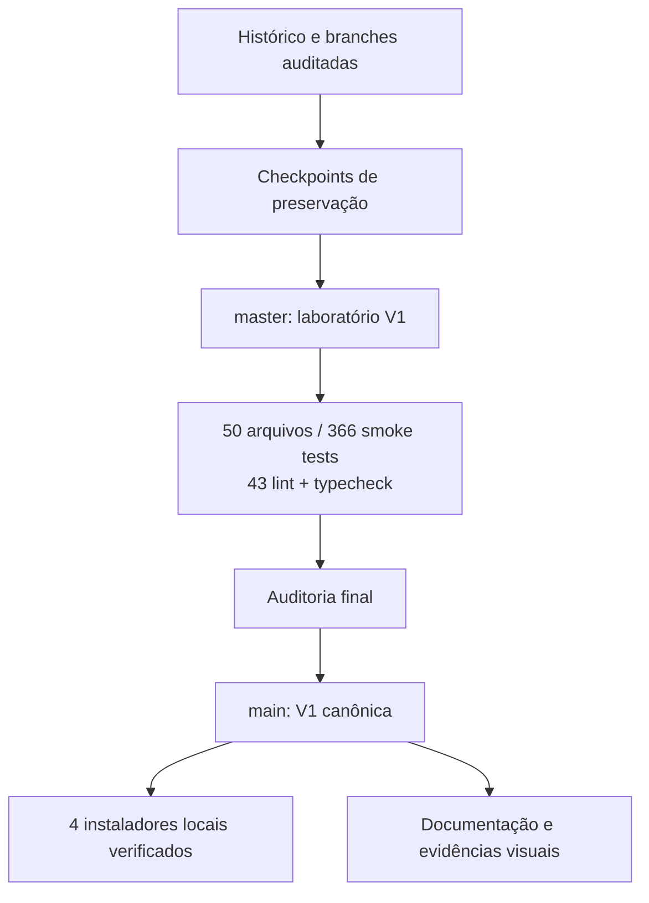
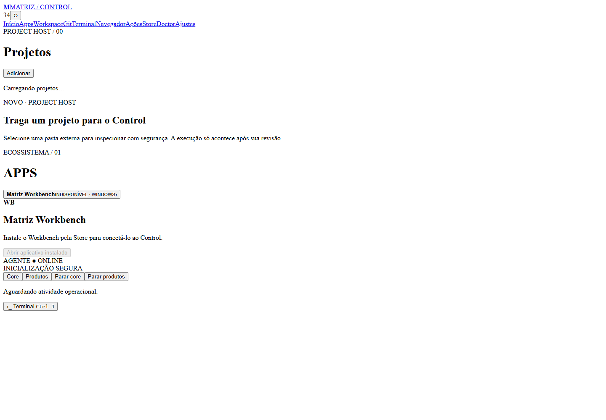
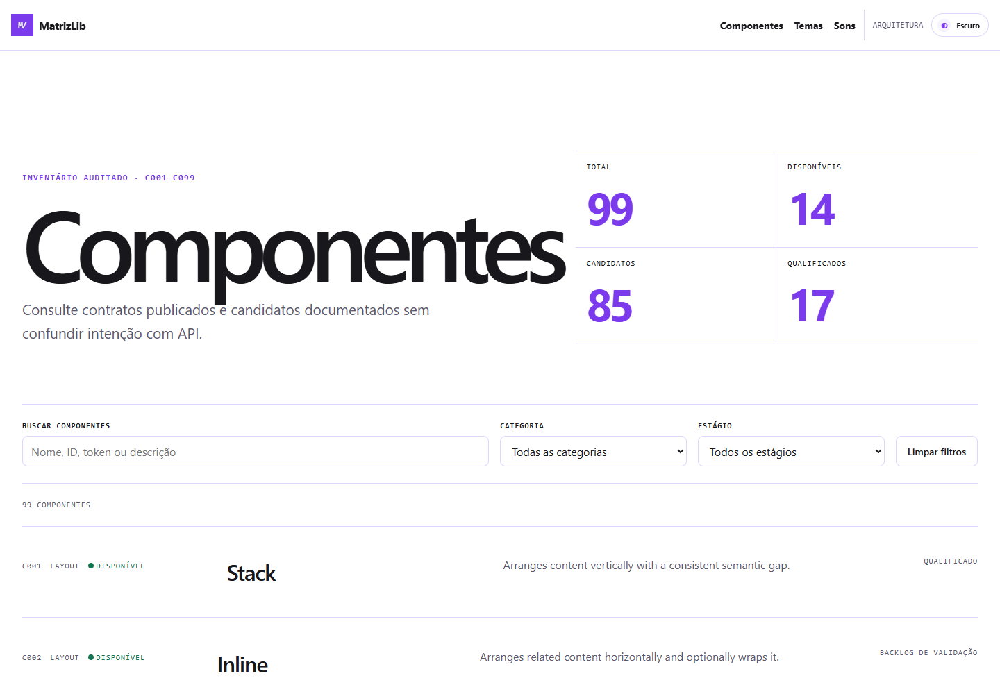

# Matriz V1 — dossiê de consolidação

Data de corte: **27 de agosto de 2026**. Este dossiê registra a promoção seletiva do patrimônio Git para a `main`. A consolidação não juntou cegamente todas as branches: preservou checkpoints, incorporou implementações tecnicamente úteis e manteve experiências, duplicações e artefatos fora da linha principal.

## Resultado executivo

- `main` é a linha principal canônica da V1.
- O núcleo da consolidação foi entregue em oito commits rastreáveis, de `cdfadee` a `041f6ba`.
- Quatro instaladores Windows locais e não assinados foram gerados e verificados por SHA-256.
- O instalador Seumei Desktop ficou **INDEFINIDO/BLOQUEADO** por depender de duas URLs HTTPS oficiais ainda não fornecidas.
- Checkpoints, worktrees e stashes de preservação não foram apagados.
- Nenhum push ou GitHub Release foi realizado nesta etapa.

## Evidências visuais

### Matriz Control

### MatrizLib

O print do Hub não foi incluído: a aplicação permaneceu em “Carregando Hub…” durante a captura. A ausência está registrada em vez de ocultada.

## Navegação

- [Consolidação histórica](branch-consolidation.md)
- [Arquitetura V1](architecture.md)
- [Validação e riscos](validation.md)
- [Instaladores](INSTALLERS.md)
- [Inventário técnico dos instaladores](installer-inventory.md)
- [Manifesto verificável](installer-manifest.json)

## Próximo marco recomendado

Assinar os executáveis, definir as URLs oficiais do Seumei Desktop, executar uma instalação limpa em máquina Windows separada e somente então criar a release pública `v1.0.0`.
