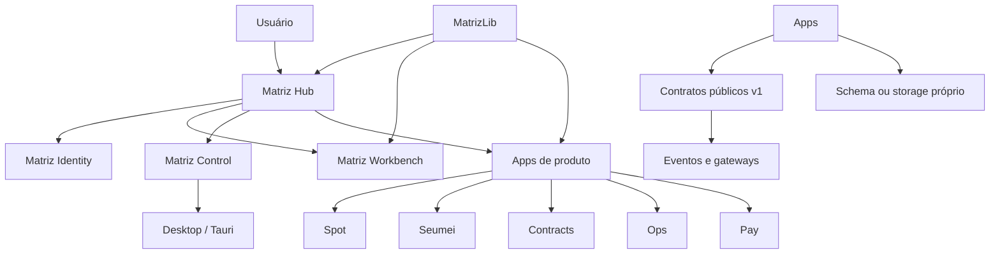

# Arquitetura consolidada da Matriz V1

## Visão do sistema

## Fronteiras obrigatórias

- Um app nunca importa `src/**` ou `app/**` de outro app.
- Integrações atravessam contratos públicos versionados, gateways locais e eventos.
- UI consome ViewModels apresentados, não entidades cruas.
- Domínio forte permanece no app proprietário.
- Packages compartilhados só recebem responsabilidades estáveis, neutras e já usadas por dois ou mais apps.
- O bootstrap do app é o ponto de composição autorizado.

## Superfícies operacionais

| Superfície | Papel na V1 | Porta local documentada |
| --- | --- | ---: |
| Matriz Hub | entrada e control plane | 3000 |
| Spot | operação artística | 3001 |
| Matriz Admin | administração | 3002 |
| Contracts | contratos | 3003 |
| Willdash | metas e atividade | 3004 |
| Sites | conteúdo/configuração | 3006 |
| MatrizLib | catálogo visual | 3007 |
| Seumei | operação do produto | 3008 |
| Matriz Control | cockpit operacional | 3009 |
| Health | diagnóstico | 3010 |
| Matriz Ops | operações | 3011 |
| Matriz Pay | pagamentos | 3012 |

Portas são convenções de desenvolvimento, não evidência de serviços publicados.

## Persistência

A V1 mantém ownership por app. As fontes Prisma presentes representam `core`, `hub`, `spot`, `seumei`, `contracts` e `willdash`; Workbench permanece Git/arquivo e Sites permanece arquivo/configuração. Presença de schema não prova banco provisionado, roles, RLS ou migrations aplicadas em produção.
