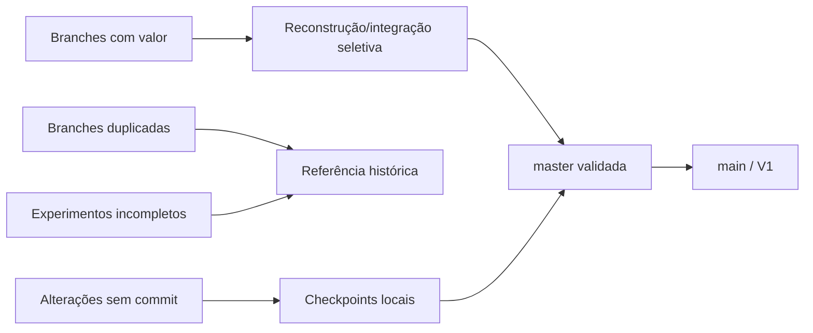

# Consolidação histórica da V1

## Estratégia aplicada

A `master` foi usada como laboratório de integração e a `main` tornou-se a linha principal após os gates. O conteúdo foi organizado em ondas pequenas e identificáveis, sem apagar branches, stashes ou checkpoints.

| Ordem | Commit | Patrimônio consolidado |
| ---: | --- | --- |
| 1 | `cdfadee` | fundação, governança e contratos arquiteturais |
| 2 | `f8274ee` | aplicações centrais e integrações básicas |
| 3 | `7fc9c66` | identidade e desktop |
| 4 | `a08242f` | Seumei e administração |
| 5 | `56f7bd5` | Hub e MatrizLib |
| 6 | `58e3060` | Control, Workbench e Health |
| 7 | `772120a` | comandos Seumei e evidências de auditoria |
| 8 | `041f6ba` | operações e pagamentos |

Os commits posteriores (`6f17ed6`, `474997d`, `19371cb` e `d13db21`) documentam e operacionalizam o pacote local de release; não fazem parte das oito ondas funcionais.

## O que “juntar” significa aqui

Portanto, **nem toda branch foi mesclada**. Seu patrimônio foi auditado e preservado; somente o estado coerente passou à V1. Isso evita reintroduzir regressões, conflitos de UX e implementações substituídas.

## Recuperação

- Não excluir branches de origem até a aceitação formal da V1.
- Não apagar os quatro stashes nem worktrees preservados sem uma auditoria posterior.
- Antes de publicar, criar uma tag anotada e uma cópia externa dos instaladores e de seus hashes.
- Em regressão, retornar à referência `041f6ba` para o núcleo consolidado; documentação e empacotamento permanecem em commits posteriores.
