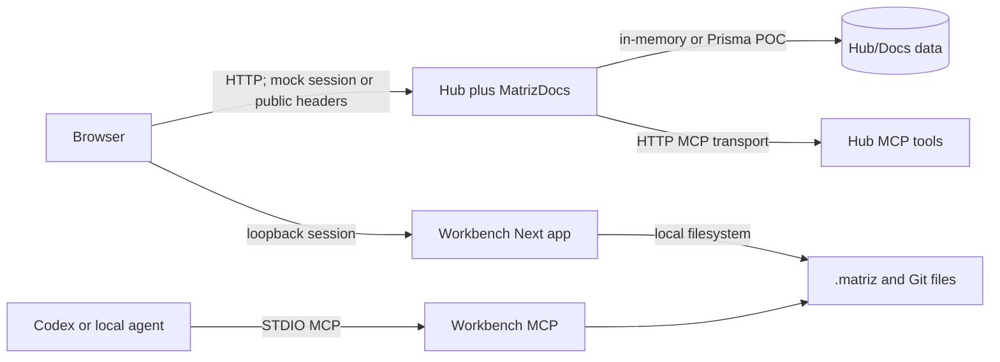
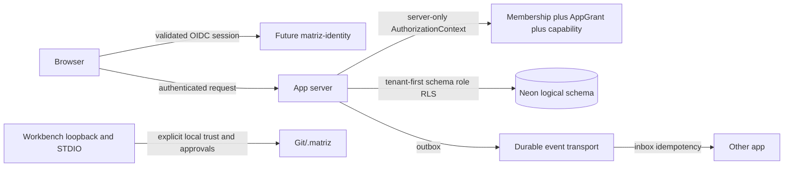

# Threat model — current POC and approved target

## Scope, classification, and backlog keys

This model covers tracked request-facing surfaces in
[Endpoint inventory](./ENDPOINT-INVENTORY.md): Hub/MatrizDocs HTTP and MCP,
and Workbench loopback HTTP, Server Actions and STDIO MCP. It does not assert
edge, Vercel, CDN, WAF, Cloud Run, Neon or provider controls unless source
shows them; those controls are **not visible; verify**.

Canonical backlog keys are intentionally narrow: **item 7** is this inventory
and threat model; **item 8** removes Hub/MCP bypasses; **item 9** fixes
tenant-unsafe queries; **item 10** is the Next/React dependency baseline; and
**item 17** establishes roles, grants and RLS. A row that cites an item names
only the outcome that item owns.

The closed global whitelist is User, authentication credentials/challenges,
OIDC clients and institutional catalog. Operational records—including
ExternalLinks—are tenant-owned in the approved target. Documents, MatrizDocs
entities/relations/suggestions/context, telemetry, events, feature overlays,
cache entries, Workbench `.matriz/**` artifacts, local session state and
provider receipts are confidential tenant or local operational data.

## Trust boundaries

### Current POC — evidence-backed

MatrizDocs derives `x-tenant-id`, `x-actor-id`, and actor type from public
headers at `apps/matriz-hub/src/domains/docs/application/access.ts:26-45`.
Mock session transport remains at
`apps/matriz-hub/app/api/auth/mock/session/route.ts:7-24`. Workbench's
loopback HTTP/STDIO premise is documented in its README; source starts STDIO at
`apps/matriz-workbench/src/mcp/server.ts:1-2` and checks a local session
digest at `apps/matriz-workbench/src/auth/session.ts:23-28`.

### Approved target — not current implementation

The target derives `AuthorizationContext` server-side and denies by default;
headers, body and query never grant authority
(`docs/architectural-laws.md`, L1/L3/L10). Identity, Cloud Run, durable
outbox/inbox, Neon roles/RLS, edge controls and offline-sync protection are
approved targets, not current controls.

## Findings

| ID | Severity | Current evidence | Impact/current control | Correct containment path | Residual risk |
| --- | --- | --- | --- | --- | --- |
| TM-01 | Critical | `apps/matriz-hub/src/domains/docs/application/access.ts:26-45` accepts public actor/tenant headers. | Tenant impersonation; equality check follows caller-derived context. | **Item 8:** remove Hub bypass. **Item 9:** tenant-safe queries. **Item 17:** Membership/AppGrant/roles/RLS. | Critical. |
| TM-02 | Critical | Docs mutations, e.g. `apps/matriz-hub/app/api/docs/documents/route.ts:25-41`, use TM-01 actor. | Cross-tenant create/change/publish; error mapper only. | **Item 8:** no bypass; **item 9:** tenant predicates; **item 17:** grants/RLS; add CSRF/origin/audit with the server boundary. | Critical. |
| TM-03 | High | `apps/matriz-hub/app/api/auth/mock/*/route.ts`; CORS/session at `.../session/route.ts:7-24`. | Mock cookie/state is not production identity. | **Item 8:** remove/isolate the Hub bypass; **item 17:** bind grants after real identity. | High. |
| TM-04 | High | `apps/matriz-hub/app/api/ecosystem/cache/route.ts:16-45`. | Cache poison/leak; Origin parser exists but `updatedBy` is caller data. | **Item 9:** tenant-safe cache/query boundary; **item 17:** grants/RLS. | High. |
| TM-05 | High | Hub MCP POST at `apps/matriz-hub/app/api/mcp/route.ts:32`; mutation tools at `src/mcp/tools.ts:28` and `src/domains/docs/mcp/tools.ts:46-106`. | Tool caller can induce ingestion/document effects; no target grant visible. | **Item 8:** remove Hub/MCP bypasses; **item 9:** tenant predicates; **item 17:** capability/grants/RLS. | Critical for mutation tools. |
| TM-06 | High | Workbench actions guard at `apps/matriz-workbench/app/actions.ts:151-153`; write tools at `src/mcp/server.ts:255-498`. | Local compromise can alter `.matriz` or invoke integrations. | Item 7 records this local-trust scope; enforce host/origin/CSRF/filesystem allowlist before exposing it beyond loopback. | High on compromised machine. |
| TM-07 | Medium | Codex start route `apps/matriz-workbench/app/api/codex/projects/[projectId]/requests/[requestId]/start/route.ts:17-41`. | Local DoS/unwanted run; session, Zod and 12/min limit visible. | Item 7 records scope; verify loopback bind and approval/run ownership. | Medium. |
| TM-08 | High | Import/document body at `apps/matriz-hub/app/api/docs/{documents,imports}/route.ts:9-41`. | Stored XSS, oversized/parser abuse if rendered/exported; sanitizer/size policy not visible. | **Item 8:** Hub boundary policy; **item 17:** capability-based authorization. | High. |
| TM-09 | Medium | Workbench collaboration routes in the inventory under `/api/collaboration/**`. | SSRF/outbound credential, redirect/host abuse if adapter validation is weak. | Item 7 records local scope; verify allowlist/timeouts/body limits/redaction before network deployment. | Medium. |
| TM-10 | High | In-memory POC bus/cache in `docs/app-communication.md`; public reads in inventory. | Tenant cache leak, replay/loss/order ambiguity. | **Item 9:** tenant-safe data/cache queries; **item 17:** roles/grants/RLS. Durable events remain a separate approved-target delivery. | High. |
| TM-11 | Medium | MCP errors: Workbench `src/mcp/server.ts:851-879`, Hub `src/mcp/tools.ts:92-94`. | Path/internal error leakage; partial public mapping only. | Hub-facing error boundary belongs with **item 8**; verify structured redaction. | Medium. |
| TM-12 | Medium | CI/install policy in `docs/CHANGE-SAFETY.md`; runtime provenance/SBOM/egress not visible. | Supply-chain compromise has monorepo blast radius. | **Item 10:** Next/React baseline; retain audit/lock review and add provenance/SBOM/least-privilege CI separately. | Medium. |
| TM-13 | Future-high | Offline/sync is target-only in canonical docs. | Replay, stale grant, device data exposure when introduced. | **Item 17:** roles/grants/RLS prerequisite; define encryption/revocation/conflict/idempotency before offline delivery. | Not current endpoint. |

## Coverage and containment path

Authentication/authorization and tenant isolation: TM-01–06; CSRF/origin:
TM-02/04/06; XSS/markdown: TM-08; SSRF/outbound/redirect/host: TM-09;
files/path traversal: TM-06; cache: TM-04/10; MCP abuse: TM-05/06; supply
chain and runtime dependency baseline: TM-12; logging/errors: TM-11; DoS/rate/body:
TM-07/08/09; distributed events: TM-10; offline: TM-13.

Containment is planned, not implemented. **Item 7** is the evidence inventory
you are reading. **Item 8** removes Hub/MCP bypasses. **Item 9** fixes
tenant-unsafe queries. **Item 10** maintains the Next/React baseline.
**Item 17** delivers roles, grants and RLS. Until those item-specific outcomes
exist, Hub/MatrizDocs remains a POC with critical authorization debt; Workbench
is a trusted-local tool, not a network security boundary.

